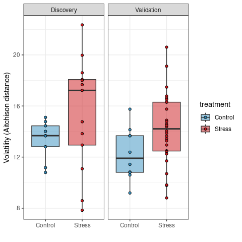

<!-- README.md is generated from README.Rmd. Please edit that file -->

## Introduction

Volatility refers to the degree of instability (or change over time) in
the microbiome. High volatility, ie an unstable microbiome, has been
associated with an exaggerated stress response and conditions like IBS.

This library provides a basic framework to calculate volatility for
timepoint microbiome data.

If you use this software, please cite our work.

Thomaz F.S Bastiaanssen, Anand Gururajan, Marcel van de Wouw, Gerard M
Moloney, Nathaniel L Ritz, Caitriona M Long-Smith, Niamh C Wiley, Amy B
Murphy, Joshua M Lyte, Fiona Fouhy, Catherine Stanton, Marcus J
Claesson, Timothy G Dinan, John F Cryan, Volatility as a Concept to
Understand the Impact of Stress on the Microbiome,
Psychoneuroendocrinology
<https://doi.org/10.1016/j.psyneuen.2020.105047>

## Setup

OK, now let’s get started. We’ll load a complementary training dataset
using `data(volatility_data)`. This loads a curated snippet from the
dataset described in more detail here:
<https://doi.org/10.1016/j.psyneuen.2020.105047>

The method presented here is differs only marginally from the one used
there.

``` r
#install and load volatility library
#devtools::install_github("thomazbastiaanssen/volatility")
library(volatility)

#load tidyverse to wrangle and plot results
library(tidyverse)
```

    ## ── Attaching packages ─────────────────────────────────────── tidyverse 1.3.1 ──

    ## ✓ ggplot2 3.3.5     ✓ purrr   0.3.4
    ## ✓ tibble  3.1.6     ✓ dplyr   1.0.8
    ## ✓ tidyr   1.2.0     ✓ stringr 1.4.0
    ## ✓ readr   2.1.2     ✓ forcats 0.5.1

    ## ── Conflicts ────────────────────────────────────────── tidyverse_conflicts() ──
    ## x dplyr::filter() masks stats::filter()
    ## x dplyr::lag()    masks stats::lag()

``` r
#load example data + metadata from the volatility study study
data(volatility_data)
```

## Input data

The main `volatility` function does all the heavy lifting here. It
expects two objects:

-   `counts`, a microbiome feature count table, with columns as samples
    and rows and features.
    -   The `vola_genus_table` object is an example of an appropriately
        formatted count table.

``` r
vola_genus_table[4:10,1:2]
```

    ##                               Validation_Pre_Control_1 Validation_Pre_Control_2
    ## Atopobiaceae_Olsenella                               0                        0
    ## Coriobacteriaceae_Collinsella                        0                        0
    ## Eggerthellaceae_DNF00809                           102                       47
    ## Eggerthellaceae_Enterorhabdus                       53                      114
    ## Eggerthellaceae_Parvibacter                         21                       20
    ## Bacteroidaceae_Bacteroides                         616                      453
    ## Marinifilaceae_Odoribacter                         780                      915

-   `metadata`, a vector in the same order as the count table, denoting
    which samples are from the same source.
    -   The column `mouse_ID` in `vola_metadata` is appropriate for
        this.

``` r
head(vola_metadata)
```

    ##                  sample_ID     cohort timepoint treatment ID
    ## 1 Validation_Pre_Control_1 Validation       Pre   Control  1
    ## 2 Validation_Pre_Control_2 Validation       Pre   Control  2
    ## 3 Validation_Pre_Control_3 Validation       Pre   Control  3
    ## 4 Validation_Pre_Control_4 Validation       Pre   Control  4
    ## 5 Validation_Pre_Control_5 Validation       Pre   Control  5
    ## 6 Validation_Pre_Control_6 Validation       Pre   Control  6

## Basic use

``` r
vola_out <- volatility(counts = vola_genus_table, metadata = vola_metadata$ID)
```

## Plot the results

``` r
vola_out %>%
  #Merge the volatilty output with the rest of the initial metadata using the shared "ID" column
  left_join(vola_metadata[vola_metadata$timepoint == "Pre",], "ID") %>%
  
  #Pipe into ggplot
  ggplot(aes(x = treatment, y = volatility, fill = treatment)) +
  
  #Define geoms, boxplots overlayed with data points in this case
  geom_boxplot(alpha = 1/2)+
  geom_point(shape = 21) +
  
  #Split the plot by cohort
  facet_wrap(~cohort) +
  
  #Tweak appearance 
  scale_fill_manual(values = c("Control" = "#3690c0", "Stress"  = "#cb181d")) +
  theme_bw() 
```

<!-- -->
